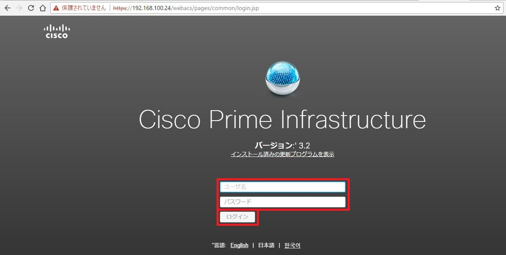
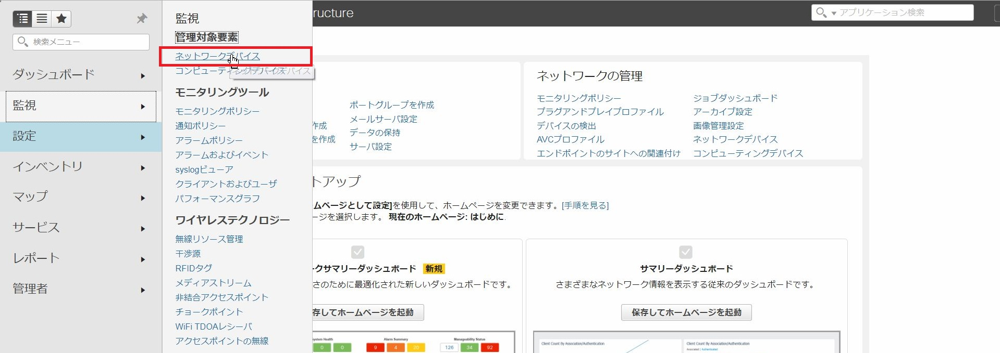
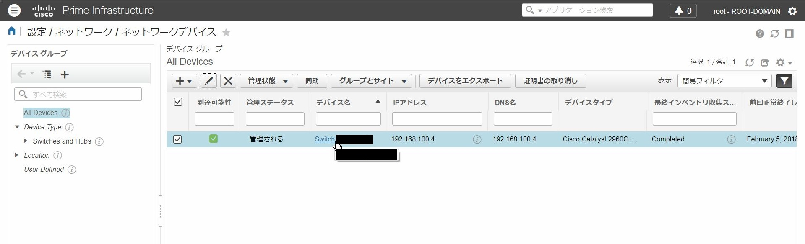
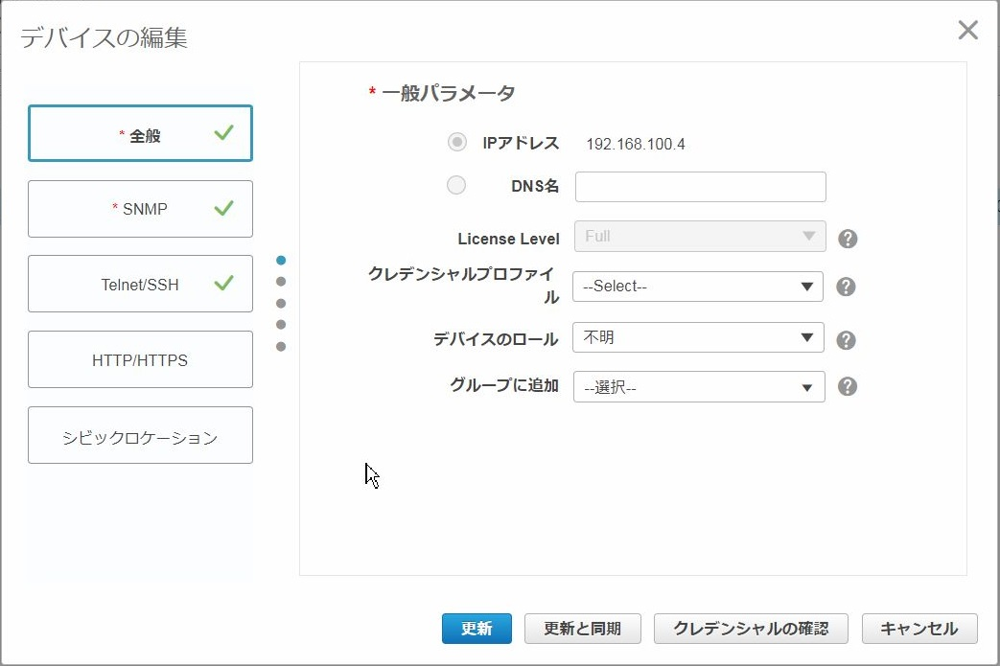
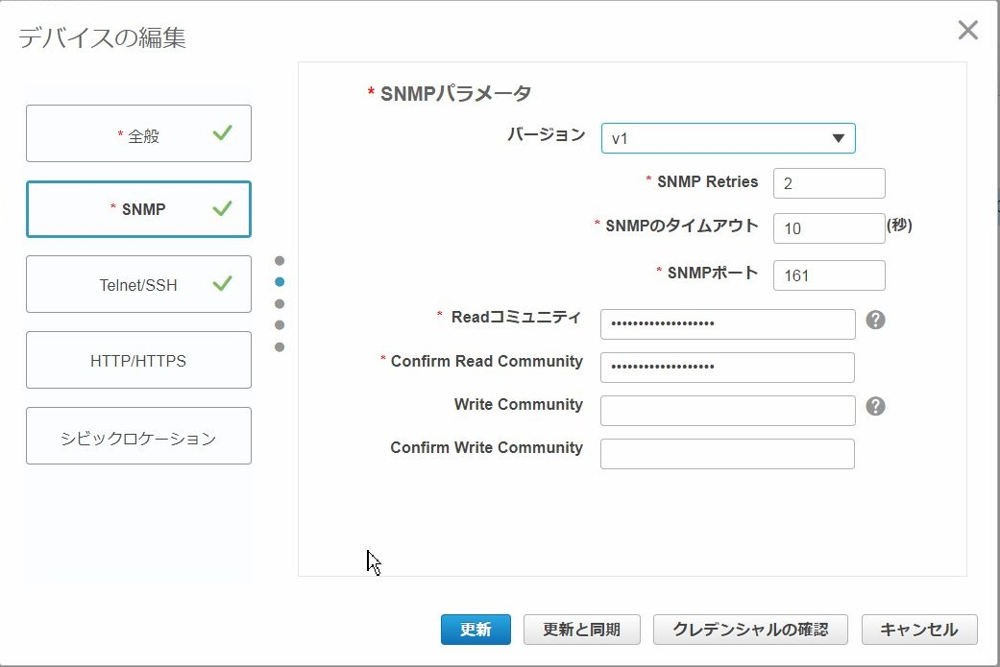
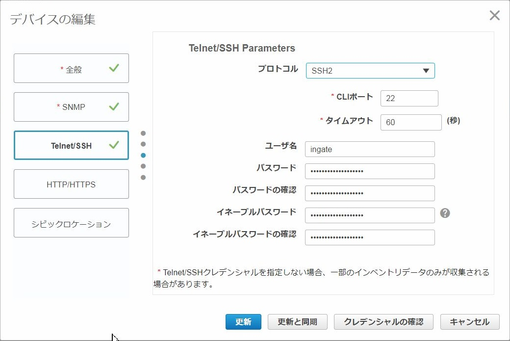
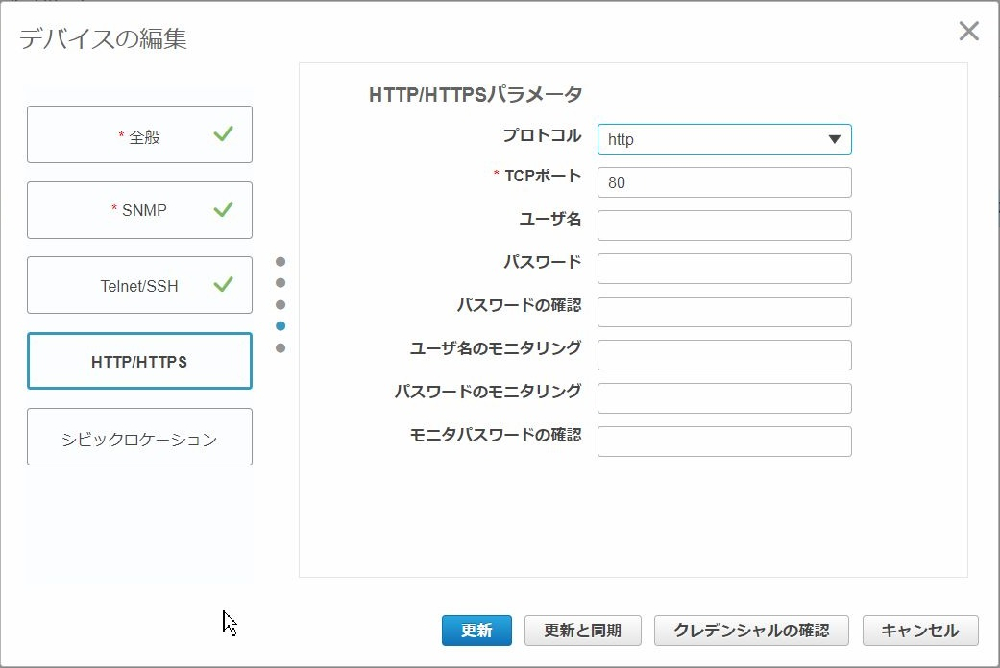
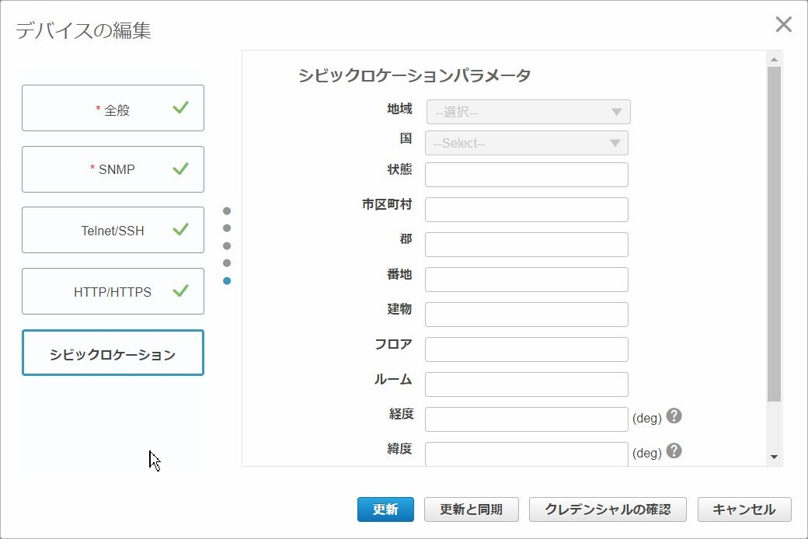

# Cisco Prime Infrastructure 3.2 機器登録

## 概要
Cisco Prime InfrastructureにCatalyst 2960シリーズを登録して管理します。

## インストール手順
1. WEBブラウザにてセットアップ画面で設定したIPアドレスに接続し、ログイン画面が表示されるので、ユーザー名とパスワードを入力してログインします。

2. 左上のメニューから設定 - 管理対象要素 - ネットワークデバイスをクリックします。

3. 「デバイスの追加」をクリックします。

4. 「全般」にてIPアドレス等を入力します。

5. 「SNMP」にてSNMPのバージョン等を入力します。

6. 「Telnet/SSH」にて機器へのログイン情報を入力します。 
   テンプレート機能によりコンフィグの流し込みなどが行えるようになります。

7. 「HTTP/HTTPS」にて情報入力します。

8. 「シビックロケーション」にて機器の設置場所を入力します。 
   必要項目の入力が完了したら「更新と同期」をクリックします。 

9. デバイスグループ画面にて追加した機器の管理ステータスが「管理される」になっていることを確認します。
