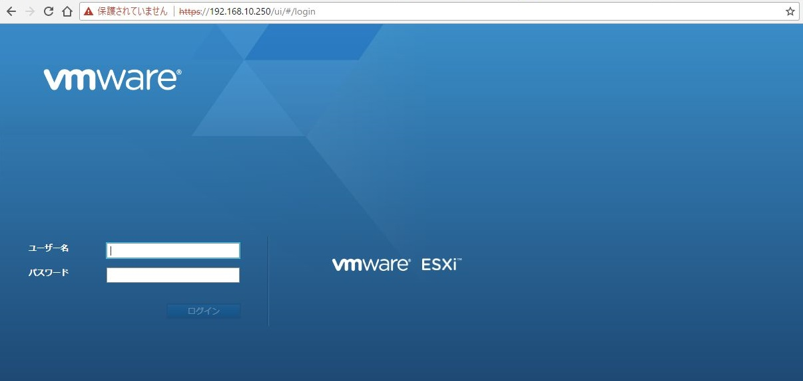
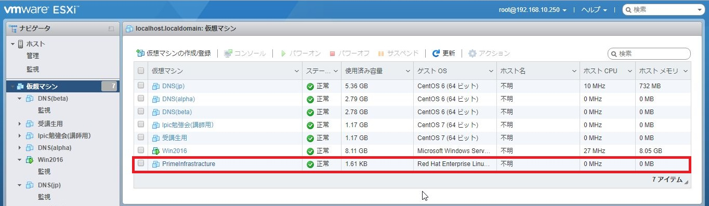
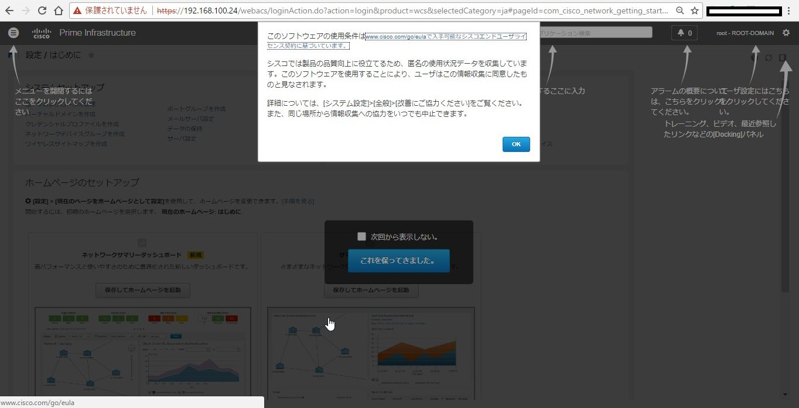

# Cisco Prime Infrastructure 3.2 インストール

## 事前準備
Cisco Prime Infrastructure [評価版](https://ciscosoftware.mediuscorp.com/prime)をダウロードします。
評価版のライセンスは60日間有効（無料）です。
詳しくは[PI: よくある質問](https://community.cisco.com/t5/%E3%83%8D%E3%83%83%E3%83%88%E3%83%AF%E3%83%BC%E3%82%AF%E3%82%A4%E3%83%B3%E3%83%95%E3%83%A9%E3%82%B9%E3%83%88%E3%83%A9%E3%82%AF%E3%83%81%E3%83%A3-%E3%83%89%E3%82%AD%E3%83%A5%E3%83%A1%E3%83%B3%E3%83%88/pi-%E3%82%88%E3%81%8F%E3%81%82%E3%82%8B%E8%B3%AA%E5%95%8F-%E3%83%A9%E3%82%A4%E3%82%BB%E3%83%B3%E3%82%B9%E3%81%AB%E3%81%A4%E3%81%84%E3%81%A6-q1-10/ta-p/3725975)をご確認ください。

## インストール条件の確認
今回は[データシート](https://www.cisco.com/c/en/us/products/collateral/cloud-systems-management/prime-infrastructure/datasheet-c78-735696.html)の「Virtual appliance resource requirements」の「Express」にあたります。

## インストール手順
1. VMware ESXiがインストールされたサーバに接続します。 
   警告が表示されたら詳細をクリックします。

2. IPアドレスにアクセスする（安全ではありません）をクリックします。

3. ログイン画面が表示されたらユーザー名とパスワードを入力してログインします。

4. 「仮想マシンの作成/登録」をクリックします。

5. 仮想マシン作成ウィザードが立ち上がります。 
   「OVFファイルまたはOVAファイルから仮想マシンをデプロイ」を選択して「次へ」をクリックします。

6. 仮想マシンの名前の指定とCisco PIの.ovaファイルを指定します。 
   アップロードが完了すると指定した.ovaファイルが表示されます。 
   問題なければ「次へ」をクリックします。

7. 使用許諾所が表示されますので「同意します」をクリックして「次へ」をクリックします。 
   ※検証環境では8vCPUだったためか、アプライアンスのタイプを選択出来ませんでした。

8. デプロイのオプションが表示されますので必要に応じて指定して「次へ」をクリックします。

9. ここまでの設定を確認して「完了」をクリックします。

10. デプロイのオプションが表示されますので必要に応じて指定して「次へ」をクリック

11. 仮想マシン一覧に作成した仮想マシンが存在することを確認します。 
    この時点でマシンの起動準備が始まっており、自動で起動してきす。

12. マシンが起動してきたら、コンソールを開きます。

13. キーボードを日本語に設定します。

14. 「login:」で「setup」と入力して ↵ を押下します。

15. 次のパラメータを入力します。
    - ホスト名：仮想アプライアンスのホスト名
    - IPアドレス：仮想アプライアンスのIPアドレス
    - IPデフォルトネットマスク：IPアドレスのサブネットマスク
    - IPデフォルトゲートウェイ：デフォルトゲートウェイのIPアドレス
    - デフォルトDNSドメイン：デフォルトのドメイン名
    - プライマリネームサーバ：プライマリネームサーバのIPアドレス
    - セカンダリネームサーバ：セカンダリネームサーバのIPアドレス
    - プライマリNTPサーバ：プライマリNTPサーバのIPアドレス
    - セカンダリNTPサーバ：セカンダリNTPサーバのIPアドレス
    - システムタイムゾーン：日本の場合は「Japan」
    - クロック時間：サーバの時間帯に基づいた時刻
    - ユーザー名：コンソール、SSHを使用してサーバにログインするために使用するユーザー。デフォルトはadmin
    - パスワード：上記で設定したユーザーのパスワード

16. 15の入力完了後、インストールされ完了するとインストール後のパラメータの入力が求められます。
    - 「High Availability Role Selection」、HA構成としてセカンダリサーバがある場合は「Yes」、スタンドアロンで動かす場合は「No」と入力します。
    - 「Web Interface Root Password」：デフォルトのルート管理者のパスワードを設定します。
    - ここまでの設定に修正がなければ「Yes」を選択、修正する場合は「No」を選択します。

17. インストールが完了するとCLI画面に「login」と表示される

18. WEBブラウザにてセットアップ画面で設定したIPアドレスに接続し、ログイン画面が表示されるので、ユーザー名とパスワードを入力してログインします。

19. Cisco PIログイン直後の画面です。

20. 画面右上の「root-ドメイン名」から「Prime Infrastructureについて」をクリックしてインストールしたバージョンを確認します。
